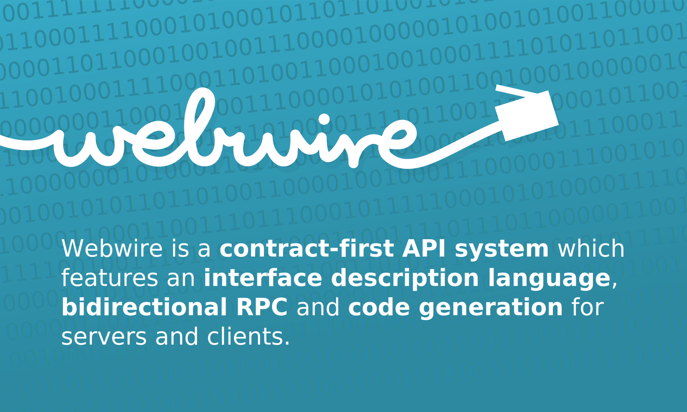

Webwire is a **contract-first API** system which features an
[interface description language](/idl.md),
a network [protocol](/protocol.md) and
[code generator](/codegen.md) for both servers and clients.

This repository contains the documentation sources used to generate
the website at [https://webwire.dev/](https://webwire.dev/).

## Resources

- **Website:** [https://webwire.dev/](https://webwire.dev/)
- **GitHub:** [https://github.com/webwire/](https://github.com/webwire/)
- **Discord:** [https://discord.gg/jjD6aWG](https://discord.gg/jjD6aWG)

## Building blocks

- The [webwire interface description language](/idl.md)
  describes service endpoints and how they are called.

- The [webwire protocol](/protocol.md) is the actual representation
  how data is transferred between client and server.

- The [webwire code generator](/codegen.md) uses the schema
  language to generate client and server stubs.

- The **webwire library** is language specific and is used together
  with the code generated by the [webwire code generator](/codegen.md)
  to write servers and clients using that interface.

## Unique selling points

- Webwire generates client and server code which is ready to run. The
  generated code contains everything to make requests and implement
  services.

- Webwire supports both **stateless unidirectional** communication and and
  **stateful bidirectional** communication. This makes it a perfect fit for
  application that require some kind of real-time update from the server
  without the client having to poll for updates.

- Webwire validates requests and responses. If data does not match the
  given schema an error is raised an the data is not processed any
  further.

- Webwire is modelled after programming languages and not after a
  serialization format. Therefore types like `UUID`, `Date` and `Time`
  are part of the specification even if the used serialization format
  does not support them. When using a serialization format which does
  not support those types natively (e.g. JSON) they are encoded as
  string. This is transparent to the user of webwire.

- Webwire has a special type called `fieldset`. Fieldsets can be used to
  construct a struct out of another struct by picking a subset of fields.
  This is especially useful when designing APIs where multiple endpoints
  use almost the same structure which just differs in a few fields.

## Non goals

- Webwire can not be used to describe existing APIs. Webwire only makes
  sense as a whole package. The IDL, protocol, code generator and
  libraries all make a complete package and leaving out one or the other
  just doesn't make any sense. If you need to document an existing API
  have a look at
  [OpenAPI](https://swagger.io/docs/specification/about/).
